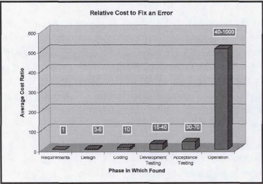

# Game 개발 프로세스 개선

목차
1. Intro
2. Now
3. Strategy
    * Google
    * FaceBook
    * Microsoft
4. Action

## 1. Intro ##
- 문제점
  - 서비스는 더 복잡해지고, 대형화 되고 있음
  - 고객들은 더 빠른 사이클의 업데이트를 요구
  - 프로세스의 변화 없이는 더 빠르게 움직여야 하는 상황

- 목표
  - 안정적으로 빠른 사이클의 업데이트가 가능한 방법 제시

## 2. Now ##
- 기존 개발 스펙 진행 방식
  - 요구사항 -> 디자인 -> 개발 -> 릴리즈 -> 테스트 -> 서비스
  
- 오류 수정 비용 개선 필요
  - 선행해서 오류를 수정하면 큰 폭의 개발 비용 감소 효과
  
  - 테스트 시기를 Shift-Left 하는 전략 도입

- 브랜치 전략 개선 필요
  - 많은 개발팀이 GitFlow와 같은 브랜치 전략을 유사하게 사용함
  
  - 항상 서비스 가능한 Develop 브랜치가 있다면 빠른 서비스가 가능
  - Feature 브랜치 도입으로 항상 서비스 가능한 Develop 브랜치 구조 필요
  - 현실은 적절한 도구의 지원이 없어서 프로그램쪽만 Feature 브랜치가 도입가능

## 3. Strategy ##
- 다른 IT 회사들은 어떻게 대응하고 있을까?
### Google ###
- 링크
### Facebook ###
- 링크
### Microsoft ###
- 링크

## 4.Action ##
- 사람
  - 테스트 인력 구성
- 환경
  - 인프라 구축
  - Robot Framework
  - CI 연동
- 프로세스
  - 개발자가 최고의 테스터
  - 브랜치 전략
  - 테스트 자동화 프로세스 도입

